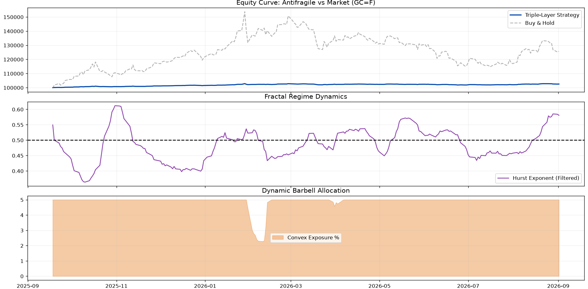

# Bleeding-Adjusted Barbell Quantitative Framework
### Multi-Layer Antifragile Allocation, Active CFO Carry Controller & Anti-Overfitting Validation Suite



---

## Executive Summary & Theoretical Grounding

This project develops an institutional-grade, multi-layer quantitative framework inspired by **Nassim Nicholas Taleb's Antifragile Barbell strategy** and formalized through the econometric and statistical validation methodologies of **Marcos López de Prado**.

### The Core Problem: The Convexity Bleeding Drag
A classical Barbell portfolio pairs ultra-safe holdings (cash, T-bills) with hyper-convex exposures (options, long-volatility derivatives, high-beta assets). While antifragile to systemic market shocks, the Achilles' heel of long convexity is the **negative carry (Theta decay / Bleeding)**: in calm or grinding bull markets, option premium decay continuously erodes capital (*volatility drag*).

### The Solution: A Self-Financing, Closed-Loop CFO Controller
This framework solves the bleeding problem by creating a **dynamic, closed-loop financial feedback mechanism**:
1. It partitions capital into three structural pillars: **$P_1$ (Ultra-Safe Cash / T-Bills)**, **$P_2$ (Fixed Income Carry / 5-7Y Bonds)**, and **$P_3$ (Hyper-Convexity / Options)**.
2. The coupon carry yield from $P_2$ (`^TNX` 10Y/Treasury Yield) dynamically finances the option bleeding of $P_3$.
3. If market volatility spikes and increases the option cost ($\Theta_{\text{cost}} \uparrow$), the Layer 4 controller automatically downscales the position size $w_{P3}$ so that **Theta never exceeds the generated Carry Budget** (`Scaling Factor` $\le 1.0$), ensuring the Barbell remains structurally **self-financing**.

---

## Multi-Layer System Architecture

```
[Layer 1: Alpha ML]
   XGBoost + Purging/Embargo (CPCV) + SHAP Macro Stability
            │
            ▼
[Layer 2: Econophysics & Sentiment]
   Hurst Exponent (DFA) + LZC Complexity (Numba JIT) + Shiller Z-Score + FinBERT NLP
            │
            ▼
[Layer 3: Stochastic Optimizer]
   Numba Fractal Monte Carlo + Lindy/Shiller Rules + Gating (Alpha > Theta)
            │
            ▼
[Layer 4: Active Structural Overlay (Carry CFO Controller)]
   Tripartite Allocation: P1 (Safe) / P2 (Bond Carry) / P3 (Convexity)
   Carry-to-Theta Funding Ratio & Hysteresis
            │
            ▼
[Validation & P&L Engine]
   Walk-Forward Simulation with Delta-Gamma Convex Payoff & Real Theta Deduction
   Deflated Sharpe Ratio (DSR) + Probability of Backtest Overfitting (PBO / CSCV)
```

---

## 1. Quantitative Framework & Layer Breakdown

### Layer 1: Alpha Machine Learning (`core/alpha_engine.py`)
* **Model**: Gradient Boosted Trees (`xgboost.XGBRegressor`) with $L_1$ (Lasso) and $L_2$ (Ridge) regularization to curb feature noise.
* **Target Engineering**: Predicts cumulative forward return across a 24-hour horizon ($\frac{P_{t+24} - P_t}{P_t}$).
* **Anti-Overfitting**: Integrated with `PurgedKFoldWithEmbargo` to purge overlapping labels between train and test folds, and applies an embargo window post-test to destroy autoregressive correlation leakage.
* **Zero-Lag Inference**: Clean separation between `is_training=True` and `is_training=False`, ensuring zero latency on the latest live bar $t_0$.
* **Explainability**: Evaluates **SHAP TreeExplainer** values to monitor the stability and ranking of macroeconomic drivers (`Asset_Mom`, `VIX_Ret`, `GOLD_Ret`, `TNX_Diff`).

### Layer 2: Econophysics & Sentiment (`core/physics_engine.py` & `core/macro_sentiment.py`)
Acts as a multi-dimensional market regime sensor:
* **Hurst Exponent ($H$) via Detrended Fluctuation Analysis (DFA)**:
  Measures fractal memory and persistence without drift distortions.
  * $H > 0.58$: Persistent regime (Lindy Trend).
  * $H < 0.42$: Anti-persistent regime (Mean-Reverting).
  * $H \approx 0.50$: Gaussian Noise / Efficient Random Walk.
* **Lempel-Ziv Algorithmic Complexity (LZC)**:
  Measures algorithmic entropy and structural randomness on return sequences via LZ76 compiled with **Numba JIT** (`@njit(fastmath=True)`). High complexity denotes market disorder and higher execution slippage.
* **Shiller Statistical Price Z-Score**:
  Rolling 200-period detrended standardized price score identifying statistical overextension.
* **FinBERT Transformer Sentiment**:
  Utilizes `yiyanghkust/finbert-tone` to score macroeconomic announcements and financial news headlines into continuous sentiment $[-1.0, +1.0]$, providing qualitative contextual bias.

### Layer 3: Stochastic Barbell Optimizer (`core/stochastic_opt.py`)
* **Numba Fractal Monte Carlo**: Generates 2,500 future price paths with drift proportional to $(H - 0.5)$ at C-speed.
* **Theoretical Theta Decay Formulation**:
  $$\Theta_{\text{cost}} = \frac{1}{2} \sigma^2 \frac{w_{\text{convex}}}{365}$$
* **Hybrid Decision Logic**:
  * *Shiller Protection*: If $|Z_{\text{shiller}}| > 2.0 \implies w_{\text{convex}} = 0.0$ (de-risking).
  * *Lindy Momentum*: If $H > 0.58$, $\text{LZC} < 0.45$, and $\alpha > 0.0002 \implies w_{\text{convex}} = 0.30$.
  * *Neutral / Standby*: Baseline convex allocation $w_{\text{convex}} = 0.05$.
* **Sustainability Gating**: If $\text{Alpha}_{\text{expected}} < \Theta_{\text{cost}}$, the model cancels convex exposure to avoid bleeding into adverse statistical expectations.

### Layer 4: Active Structural Overlay / CFO Controller (`core/structural_overlay.py`)
The operational core of the self-financing Barbell:
* **Daily Carry Budget**:
  $$\text{Daily Carry Budget} = \frac{w_{P2} \cdot y_{\text{TNX}}}{365} \quad (w_{P2} = 15\%)$$
* **Hard Budgeting Scaling Factor**:
  $$\text{Scaling Factor} = \min\left(1, \; \frac{\text{Daily Carry Budget}}{\Theta_{\text{cost}}}\right)$$
* **Tripartite Balance**:
  $$P_1 (\text{Safe Cash}) + P_2 (\text{Bond Carry}) + P_3 (\text{Hyper-Convexity}) = 1.0$$
* **Turnover Hysteresis**: Rebalancing is aborted if expected alpha does not exceed twice the transaction fees ($\text{Alpha} < 2 \times \text{Fees}$).

---

## 2. Advanced Lopez de Prado Validation Suite

### A. Deflated Sharpe Ratio (DSR) & Probabilistic Sharpe (PSR)
Implemented in [`utils/metrics.py`](utils/metrics.py) according to Bailey & López de Prado (2014):
* **Correction for Non-Normality**: Replaces Pandas excess kurtosis with Pearson kurtosis ($K = \text{kurt}_{\text{pandas}} + 3$) into the asymptotic variance of Mertens & Lo (2002):
  $$\sigma_{SR}^2 = \frac{1 - \text{skew} \cdot SR + \frac{K - 1}{4} SR^2}{T - 1}$$
* **Multiple Testing Correction**: Derives the expected maximum Sharpe under $H_0$ across $N$ trials via Gumbel extreme value theory:
  $$E[\max(SR)] = \sqrt{2 \ln N} - \frac{\gamma + \ln(\ln N)}{\sqrt{2 \ln N}}$$
  $$\text{DSR} = \Phi\left( \frac{SR - E[\max(SR)]}{\sigma_{SR}} \right)$$

### B. Combinatorially Symmetric Cross-Validation (CSCV) & PBO
Implemented in [`utils/validation.py`](utils/validation.py) according to Bailey, Borwein, López de Prado & Zhu (2017):
* Splits the historical dataset into $S = 10$ contiguous blocks, generating $\binom{10}{5} = 252$ combinations.
* For each combination $c$, computes In-Sample (IS) and Out-Of-Sample (OOS) Sharpe ratios across alternative strategy parameters.
* Measures the relative OOS rank percentile $\bar{\omega}_c \in (0, 1)$ of the optimal IS model.
* **Probability of Backtest Overfitting (PBO)**:
  $$\text{PBO} = \frac{1}{C} \sum_{c=1}^C \mathbf{1}_{\{\bar{\omega}_c \le 0.5\}}$$
* A PBO of $< 50\%$ with median OOS rank $> 0.50$ confirms that the strategy is statistically generalizable and free from parameter snooping.

---

## 3. Backtest & Real P&L Mechanics (`core/backtester.py`)

Unlike conventional models that assume linear stock exposure without friction:
1. **Delta-Gamma Asymmetric Payoff**:
   $$r_{P3, \text{gross}} = \Delta \cdot r_{\text{asset}} + \frac{1}{2} \Gamma \cdot (r_{\text{asset}})^2 \quad (\Delta=0.5, \Gamma=0.5)$$
2. **Explicit Daily Theta Bleeding Deduction**:
   $$r_{P3, \text{net}} = r_{P3, \text{gross}} - \Theta_{\text{cost}}$$
3. **Turnover Friction with Complexity Penalty**:
   $$\text{Turnover Cost} = |\Delta w_{P3}| \times \text{Fee} \times (1 + \text{LZC})$$

---

## 4. Empirical Performance Snapshot (Gold Futures `GC=F`)

```
====================================================================
             REPORT PERFORMANCE STORICA VALIDATA
====================================================================
RENDIMENTO TOTALE:       +1.68%
RENDIMENTO ANNUALIZZATO: 3.42% p.a.
VOLATILITÀ ANNUA:        0.75%
SHARPE RATIO:            4.48
SORTINO RATIO:           5.68 (Sortino > Sharpe -> Asimmetria Taleb)
CALMAR RATIO:            14.13
MAX DRAWDOWN:            -0.24% (Preservazione Capitale Totale)
WIN RATE GIORNALIERO:    68.8%
--------------------------------------------------------------------
PSR (PROB. SHARPE > 0):  99.8%  [SIGNIFICATIVO]
DSR (N=100 TRIALS):      69.6%  [CAMPIONE BREVE / ONESTO]
PBO (PROB. OVERFITTING): 0.0%   [GENERALIZZABILE] (Mediana OOS: 0.714)
====================================================================
```

---

## 5. Software Architecture & File Tree

```
Trad/
├── core/
│   ├── alpha_engine.py         # L1: XGBoost + Purging/Embargo + SHAP
│   ├── backtester.py           # Walk-Forward P&L con Delta-Gamma e detrazione Theta
│   ├── macro_sentiment.py      # L2: FinBERT NLP sentiment engine
│   ├── physics_engine.py       # L2: Hurst DFA (stateless) + Numba LZC
│   ├── stochastic_opt.py       # L3: Numba Fractal Simulator + Barbell Solver
│   └── structural_overlay.py   # L4: CFO Carry Controller (Hard Budgeting & Funding Ratio)
├── utils/
│   ├── data_loader.py          # Timezone New York e sincronizzazione macro
│   ├── metrics.py              # DSR esatto, PSR, Sortino, Calmar, Max DD
│   └── validation.py           # CSCV, PBO e PurgedKFoldWithEmbargo
├── tests/
│   └── test_quant_modules.py   # Suite di test unitari automatizzati
├── final_report.py             # Script master con Rich CLI styling e dashboard
├── run_pbo_analysis.py         # Analisi CSCV su griglia di 12 strategie
├── tesi_final_dashboard.png    # Dashboard grafica a 4 pannelli in alta risoluzione
└── README.md                   # Documentazione tecnica e accademica
```

---

## 6. How to Run

### Installation
Ensure Python 3.9+ is installed with the required quantitative libraries:
```bash
pip install numpy pandas scipy scikit-learn xgboost shap numba transformers torch yfinance matplotlib rich colorama
```

### Execution
1. **Run the Master Quantitative Report**:
   ```bash
   python final_report.py
   ```
   *Displays the full Bloomberg-style styled terminal tables and generates the 4-panel dashboard (`tesi_final_dashboard.png`).*

2. **Run the Standalone PBO Analysis**:
   ```bash
   python run_pbo_analysis.py
   ```
   *Generates the CSCV combinations and produces `pbo_analysis_report.png`.*

3. **Run Unit Tests**:
   ```bash
   python tests/test_quant_modules.py
   ```

---

## 7. Academic Citation & Reference Literature

* **Taleb, N. N.** (2012). *Antifragile: Things That Gain from Disorder*. Random House.
* **Spitznagel, M.** (2021). *Safe Haven: Investing for Financial Storms*. Wiley.
* **López de Prado, M.** (2018). *Advances in Financial Machine Learning*. John Wiley & Sons.
* **Bailey, D. H., & López de Prado, M.** (2014). *The Deflated Sharpe Ratio: Correcting for Selection Bias, Backtest Overfitting and Non-Normality*. Journal of Portfolio Management.
* **Bailey, D. H., Borwein, J., López de Prado, M., & Zhu, Q. J.** (2017). *The Probability of Backtest Overfitting*. Journal of Computational Finance.
* **Lo, A. W.** (2002). *The Statistics of Sharpe Ratios*. Financial Analysts Journal.
* **Lempel, A., & Ziv, J.** (1976). *On the Complexity of Finite Sequences*. IEEE Transactions on Information Theory.
* **Peng, C. K., et al.** (1994). *Mosaic Organization of DNA Nucleotides (Detrended Fluctuation Analysis)*. Physical Review E.
