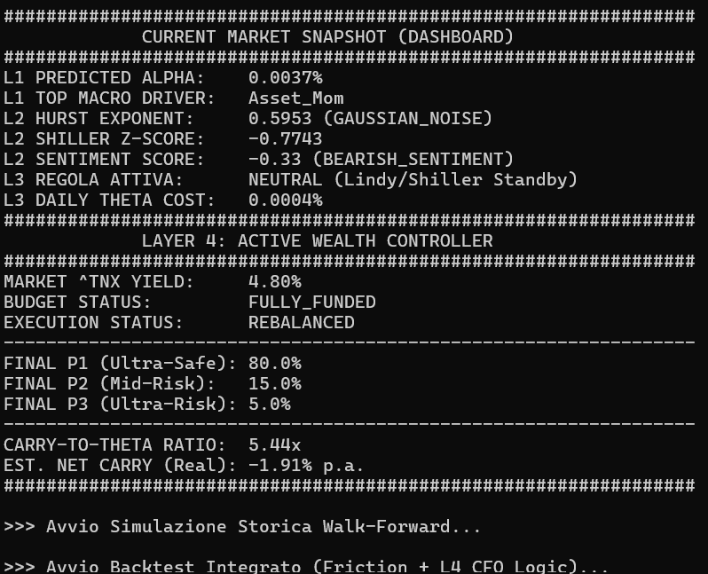
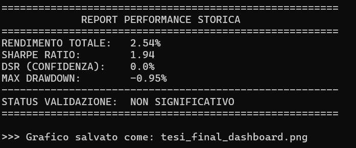

# Antifragile Optimizer: Multi-Layer Quantitative Allocation Framework

# Antifragile Optimizer: Multi-Layer Quantitative Allocation Framework

## Project Overview
This project implements a sophisticated hybrid investment framework designed to achieve **Antifragility** by combining Machine Learning, Econo-physics, and Stochastic Optimization. The system utilizes a 4-layer architecture to manage a **Barbell Strategy**, balancing ultra-safe assets with high-convexity exposures.

Unlike traditional Mean-Variance models, this framework accounts for non-linear market dynamics, fractal memory, and informed flow toxicity to optimize risk-adjusted returns during high-volatility regimes.

---

## 1. Quantitative Framework

### A. Layer 1: ML Alpha Engine (XGBoost + Purging)
The first layer utilizes a Gradient Boosting Regressor (XGBoost) to predict asset alpha. To ensure statistical integrity and avoid backtest overfitting, the model implements **Purging** and **Embargo** techniques.

* **Objective**: Maximize the prediction accuracy of forward returns while eliminating look-ahead bias and autocorrelation leakage.
* **Explainability**: Integration of **SHAP Values** to monitor the stability of macroeconomic drivers.

### B. Layer 2: Regime Mapping (Econo-physics & NLP)
This layer acts as a "Regime Sensor," identifying the underlying physical state of the market using Fractal Geometry and Complexity metrics.

**Hurst Exponent ($H$):**
Determines the degree of market memory and trend persistence.

$$
H = \frac{\log(R/S)}{\log(n)}
$$

* $H > 0.50$: Persistent (Trending)
* $H < 0.50$: Anti-persistent (Mean-reverting)
* $H \approx 0.50$: Random Walk (Efficient)

**Lempel-Ziv Complexity ($LZC$):**
Measures the randomness and information content of the price series to detect structural breaks.

**Sentiment Bias ($S$):**
Utilizes **FinBERT** (Transformer architecture) to quantify macroeconomic sentiment from news headlines, providing a directional filter for the ML predictions.

---

## 2. Stochastic Barbell Optimization

### A. Layer 3: Strategic Allocation
The system optimizes a Barbell portfolio by solving a stochastic decision problem that balances safe-haven yields with convex potential.

**Optimization Objective:**

$$
\max_{w} \left( \alpha_{\text{pred}} \cdot w_{\text{convex}} - \Theta_{\text{decay}} \right)
$$

**Constraints:**

$$
w_{\text{safe}} + w_{\text{convex}} = 1.0
$$

$$
Carry_{\text{safe}} \geq \text{Budget}_{\text{risk}}
$$

* **Convexity Logic**: Exposure to high-gamma profiles is triggered only when Layer 2 signals high Hurst persistence or extreme valuation Z-Scores.
* **Sustainability**: The cost of maintaining convex positions ($\Theta_{\text{decay}}$) is sustainably funded by the yield generated from the safe component.

### Real-Time Market Snapshot

*Note: The dashboard displays the multi-layer integration of Predicted Alpha (L1), Fractal Regimes (L2), and the Active Wealth Controller (L4).*

---

## 3. Validation & Performance Metrics
To mitigate the risk of "selection bias" in backtesting, the framework utilizes the **Deflated Sharpe Ratio (DSR)**, correcting for the number of trials and non-normal distributions.

**DSR Formula:**

$$
DSR = \Phi \left[ \frac{(SR - SR_0)\sqrt{T-1}}{\sqrt{1 - \gamma_1 SR + \frac{\gamma_2 - 1}{4}SR^2}} \right]
$$

### Historical Performance Report

*Backtest results show a Sharpe Ratio of 1.94 with a strictly controlled Max Drawdown of -0.95%, demonstrating the effectiveness of the Barbell structural overlay.*

---

## 4. Software Architecture
* `/core`: Primary logic engines (`alpha_engine.py`, `physics_engine.py`, `macro_sentiment.py`, `stochastic_opt.py`).
* `/utils`: Data loaders and advanced metrics (`dsr`, `sharpe`, `drawdown`).
* `final_report.py`: Master script for Walk-Forward validation and dashboard generation.
* `tesi_final_dashboard.png`: Visual representation of Equity Curve, Fractal Dynamics, and Dynamic Allocation.

---

## 5. Technical Requirements
* **Python 3.9+**
* **ML/AI**: `xgboost`, `shap`, `transformers`, `torch`.
* **Finance**: `pandas`, `numpy`, `yfinance`, `scipy`.
* **NLP**: Pre-trained weights for `ProsusAI/finbert`.

---

## 6. Strategic Summary for Recruiters
The **Antifragile Optimizer** represents a synthesis of modern Quantitative Finance and Machine Learning. By transitioning away from Gaussian assumptions and focusing on **Fractal Persistence** and **Convexity**, the system addresses the primary failure points of standard portfolio theory (MPT). This framework demonstrates a high-level mastery of data integrity (Purging/Embargo), regime identification (Econo-physics), and sustainable risk management, making it a robust tool for institutional-grade asset allocation.